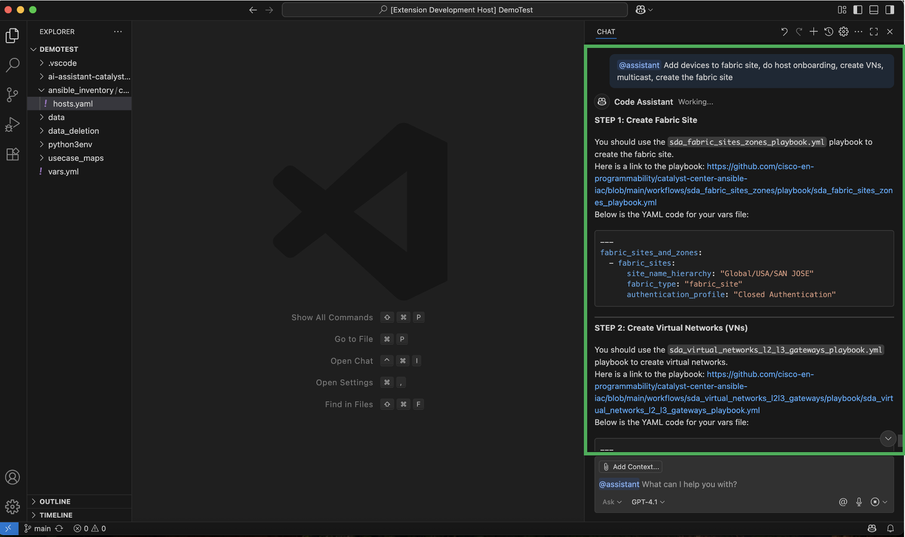

# Network as Code (NaC) AI Assistant README

VS Code extension that utilizes [Catalyst Center Ansible IaC (Infrastructure as Code)](https://github.com/cisco-en-programmability/catalyst-center-ansible-iac/tree/main) workflows and playbooks to streamline and automate network management on Catalyst Center.

---

# Table of Contents
- [Features](#features)
- [Prerequisites](#prerequisites)
- [Setup](#setup)
- [LLM Model Performance - Playbook Classification](#llm-model-performance---playbook-classification)
- [Examples](#examples)

---

# Features

### AI-Powered Chat Assistance
- **Generate YAML Code:** Use the `@assistant` chat assistant to generate YAML vars files tailored to your task by identifying the best workflow, playbook, and schema.
- **Ask Questions:** Use the `@assistant /ask` chat command to get answers to general and technical questions about Catalyst Center, Ansible, and related topics.
- **Validate YAML Code:** Use the `@assistant /validate` chat command to validate YAML code using Yamale, Ansible Lint, and YAMLlint.
- Leverages GitHub Copilot chat to provide additional assistance & features.
- *Note*: `@assistant` is only for identifying the playbook & generating vars file code for a user task. To modify existing code, use `@assistant /ask` and provide the relevant file as context.

### In-Editor Commands
- **Validate & Lint:** Instantly run schema validation and linting on your currently open vars file, with AI-generated annotations for error fixing.
  - *Note:* This command requires that a vars file is open in the editor.
- **Run Playbook:** Execute the appropriate Ansible playbook for your task by selecting the hosts, playbook, and vars files, with automatic Catalyst Center integration and detailed logs.
  - *Note:* This command requires that a vars file exists in your project.

### Inline YAML Annotations
- Receive inline suggestions and error messages directly in your editor based on validation and linting results.
- This feature is available with the "Validate & Lint" command listed above

### Seamless GitHub Integration
- Always access the latest workflows, playbooks, and schemas from the [catalyst-center-ansible-iac](https://github.com/cisco-en-programmability/catalyst-center-ansible-iac) repository.
- *NOTE:* By default, the most updated version of the `catalyst-center-ansible-iac` repository is cloned. 

### Fast, Context-Aware Responses
- Utilizes a Retrieval Augmented Generation (RAG) approach for rapid, relevant answers.
- *NOTE:* The first user prompt after activation or after a GitHub re-clone may take around 30 seconds due to initialization; all other responses are typically delivered in ~3 seconds.

Below is a consolidated table of the provided commands / actions.

| Command / Action                | Location      | Description                                                                 |
|---------------------------------|--------------|-----------------------------------------------------------------------------|
| `@assistant`                    | Chat         | Generate YAML vars files for your task by identifying the best workflow, playbook, and schema. |
| `@assistant /ask`               | Chat         | Get answers to general and technical questions about Catalyst Center, Ansible, and related topics. |
| `@assistant /validate`          | Chat         | Validate YAML code using Yamale, Ansible Lint, and YAMLlint.                |
| Validate & Lint ✔️              | Editor Menu  | Instantly run schema validation and linting on your open vars file, with AI-generated annotations for error fixing. |
| Run Playbook ▶️                 | Editor Menu  | Execute the appropriate Ansible playbook for your task, integrating with Catalyst Center and generating comprehensive logs. |
| Inline YAML Annotations         | Editor       | Receive inline suggestions and error messages based on "Validate & Lint" results. |

*NOTE:* The `@assistant /validate` command creates a temporary file to run validation on, leaving your original files untouched. 

---

# Important Note

- As mentioned above in the features, the latest version of the `catalyst-center-ansible-iac` repository is automatically cloned into your workspace as `ai-assistant-catalyst-center-ansible-iac`. **Please do not modify this folder**, as it is managed by the extension and used to support its functionality.
- This cloned folder will be automatically updated to reflect new changes and workflows.

---

# Prerequisites

Before continuing, please ensure you have the following prerequisites:
- Access to a Cisco Catalyst Center instance
- Proper network connectivity to utilize and interact with Cisco Catalyst Center
- Access to GitHub Copilot
- A project folder open in VS Code  

---

# Setup
- The setup (environment creation, dependency installation, data & inventory folder creation) has been automated, so please wait about **1 minute** for the setup process to finish.
- **Important:** After setup is complete, make sure to update the `hosts.yaml` file under the newly created `ansible_inventory/catalystcenter_inventory` folder in your VS Code project's root directory.
- You are now ready to use all the commands and features of this extension! See the [examples](#examples) below for more detailed images of how to use these features.

- If you run into any additional issues, with the extension, try executing the following terminal commands and reloading your VS Code window (Command + Shift + P —> Developer: Reload Window). The version_number below refers to the extension version number you are currently using (e.g. 0.0.4)
```
cd ~/.vscode/extensions/cisco-vscode-solutions.nac-copilot-<version_number>
npm install --platform=darwin --arch=arm64 sharp        
```
  
---

# LLM Model Performance - Playbook Classification
You may choose any Copilot LLM model available. Both GPT-4.1 and Claude-3.5 have the same playbook classification accuracy (96.27%). (Note that Claude-3.5 is included with the free version of GitHub Copilot, but GPT-4.1 is only available with the paid version.)

---

# Examples

Below are some examples of this extension in action:

## AI-Powered Chat Assistance - Generate YAML Code


## AI-Powered Chat Assistance - Generate YAML Code for Multiple Tasks


## AI-Powered Chat Assistance - Generate YAML Code for Multiple Tasks Out of Order


## AI-Powered Chat Assistance - Ask Questions


## AI-Powered Chat Assistance - Validate YAML Code


## In-Editor Commands - Validate & Lint Failure with Inline YAML Annotations


## In-Editor Commands - Validate & Lint Success


## In-Editor Commands - Run Playbook


